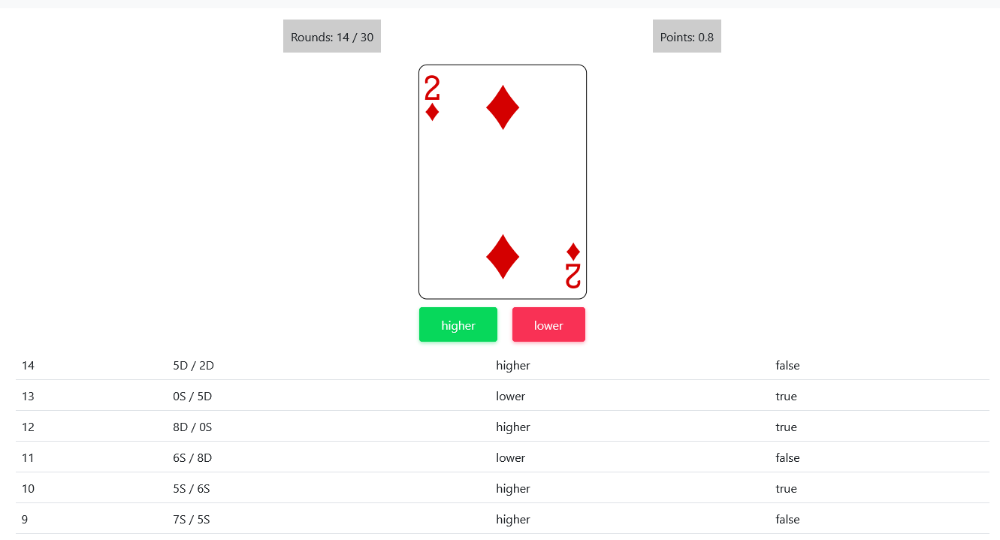

# Higher or Lower Game

Simple card game of guessing the next card from the deck

[higher-or-lower-demo.netlify.app](https://higher-or-lower-demo.netlify.app/)

[](https://app.netlify.com/sites/higher-or-lower-demo/deploys)



## Game rules:

- Player has one dice/card at a time
- There are two buttons that the player uses to decide whether the next card/dice number will be higher or lower 
- Once the player chooses one of the options, he/she gets 0.1 point for the correct answer and a new dice/card is shown
- There should be 30 rounds of the game

## Project setup
```
npm install
```

### Compiles and hot-reloads for development
```
npm run serve
```

### Compiles and minifies for production
```
npm run build
```

### Lints and fixes files
```
npm run lint
```

## Technologies
Project is created with:
* node.js: >=14.15.5 
* Vue.js: >=3.2.13

## Version
Latest: 0.1.0-dev

## Game project requirements:

- The card/dice should be represented by a picture
- History of all the rounds and results has to be created and shown
- The number of remaining rounds and the sum of points have to be visible
- Closing the app saves the current game
- If the game is resumed, the player gets a question “Reload the previous game?”
- If the player chooses “YES”, previously saved game is reloaded
- If the player chooses “NO”, a new game starts
- The project does not have time limitation, however it should not take more than a few hours
- Any tools, frameworks, librialiers or packages can be used to complete the task
- Submit the project the way you do when working with a team
- This repository is created exclusively for your recruitment process and you can interact with it the way you like 

## Copyright and license
Code and documentation copyright 2011–2021 the [Tomasz Dopierala](https://github.com/tdopierala).
Code released under the [GNU General Public License v3.0](https://github.com/tdopierala/quizzer/blob/master/LICENSE).
